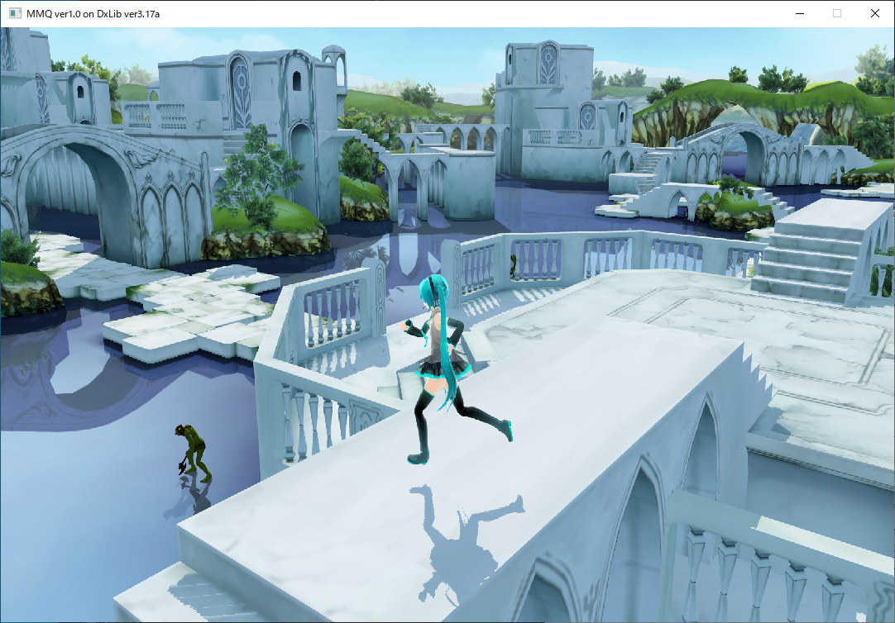

# 大学のプログラミングの講義で製作した作品

### C歴1年、C++歴半年頃の拙作

当時はgitが使えなかった上にHDDが吹き飛んだせいで、サルベージしたもののコードがロールバックしてるしコンパイルできないし、ビルド済みバイナリも設定が反映されなかったりという散々な状態ですが、当時のコードをそのままにしておきたかったので記念にこのままアーカイブしています

DxLib ver3.17aを使用して製作しています
ゲームエンジンに当たる物は使用していません

